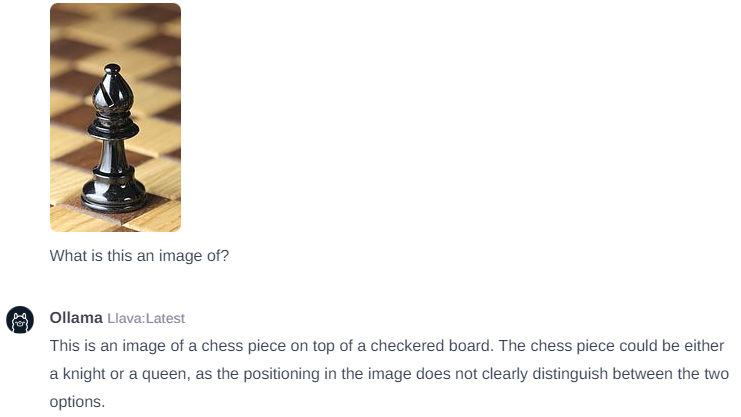

# Exploring Image Classification with Multimodal LLMs

Multimodal Large Language Models (LLMs) bring computer vision to LLMs so they can both "see" images and have the language to describe the contents of the images.

Given that LLMs are adept at handling a variety of general-purpose NLP tasks like sentiment analysis, named entity recognition, and text classification, it's interesting to consider whether these vision-enabled LLMs could supplant traditional image classification methods in a general purpose way.

The key advantage of multimodal LLMs lies in their ability to contextualize images with corresponding natural language descriptions and the use of transfer learning. This approach is more advanced than traditional image classification methods, which primarily rely on analyzing visual features. Furthermore, the inherent capability of these models for zero-shot learning allows them to potentially categorize images into previously unseen classes, based on their understanding the image context. This stands in contrast to conventional models, which necessitate specific training data for each category they are expected to identify.

This weekend project was an exploration into this possibility, with the dual objectives of learning and of course having fun. This repository includes all of the data, code and model definition files used for this project.

## LLaVA Multimodal Model

OpenAI's Multimodal "GPT-4 Vision" is state of the art and I've been very impressed with it's ability to understand images, and even detect humor and satire (memes, etc.). But lately I've been more interested in the open-source LLMs as I like not having to worry about API keys getting stolen, pathological bugs running up my charges, or worrying about private/sensitive data leaking online.

I'm going to use a 7B parameter quantized version of LLaVA (Large Language and Vision Assistant) for this project. Here are some links to the LLaVA project, papers and model:

**LLaVA Project**:
- https://llava-vl.github.io/

**LLaVA Papers**:
- https://arxiv.org/pdf/2304.08485.pdf
- https://arxiv.org/pdf/2310.03744.pdf

**LLaVA Quantized Model**:
- https://huggingface.co/liuhaotian/llava-v1.5-7b

As an example of what LLaVA is capable of, here is example of asking for a detailed description of an image:

## MNIST Handwritten Digit Classification

The [MNIST database](https://en.wikipedia.org/wiki/MNIST_database) is a large collection of handwritten digits that's commonly used in machine learning image processing tasks. For this test, I used 50 images of each digit (500 total) from the [MNIST as .jpg](https://www.kaggle.com/datasets/scolianni/mnistasjpg) dataset. I created the [mnist-classifer-model](modelfiles/mnist-number-classifier.Modelfile) definition for this test.

### Results

There results weren't as good as I expected, with only a 79.2% accuracy score. It had trouble with "0", "1", and "2", often confusing them for "3". Strange. A traditional machine learning approach should exceed 98%. 

***Confusion Matrix***:

***Precision and Recall***:
| Digit | Precision | Recall | F1-score |
|-------|-----------|--------|----------|
| 0     | 0.769231  | 0.600  | 0.674157 |
| 1     | 0.750000  | 0.660  | 0.702128 |
| 2     | 0.972222  | 0.700  | 0.813953 |
| 3     | 0.434783  | 1.000  | 0.606061 |
| 4     | 1.000000  | 0.880  | 0.936170 |
| 5     | 0.979167  | 0.940  | 0.959184 |
| 6     | 0.954545  | 0.840  | 0.893617 |
| 7     | 0.793103  | 0.920  | 0.851852 |
| 8     | 0.921053  | 0.700  | 0.795455 |
| 9     | 1.000000  | 0.680  | 0.809524 |

***Accuracy***:
| Metric       | Precision | Recall | F1-score |
|--------------|-----------|--------|----------|
| Accuracy     | 0.792000  | 0.792  | 0.792000 |
| Macro Avg    | 0.857410  | 0.792  | 0.804210 |
| Weighted Avg | 0.857410  | 0.792  | 0.804210 |

## Animal Classification

Next up is animal classification. I used the [Animals-10](https://www.kaggle.com/datasets/alessiocorrado99/animals10) dataset for this and created the [animal-classifier](modelfiles/animal-classifier.Modelfile) model definition.

### Results
The results for this were also interesting. While it did well for some animal catagories, it clearly had never seen a squirrel before as it classified most squirrels as cats. It also had difficultly distinguishing cows and spiders from cats. It looks like whenever it was unsure about these problem catagories, it just guessed "cat". It had perfect scores on both precision and recall for butterflies, elephants, and horses. It has an average accuracy of 77.4%

***Confusion Matrix***:

***Precision and Recall***:
| Animal   | Precision | Recall | F1-score |
|----------|-----------|--------|----------|
| Butterfly| 1.000000  | 1.000  | 1.000000 |
| Cat      | 0.306748  | 1.000  | 0.469484 |
| Chicken  | 1.000000  | 0.980  | 0.989899 |
| Cow      | 1.000000  | 0.420  | 0.591549 |
| Dog      | 1.000000  | 0.800  | 0.888889 |
| Elephant | 1.000000  | 1.000  | 1.000000 |
| Horse    | 1.000000  | 1.000  | 1.000000 |
| Sheep    | 1.000000  | 0.980  | 0.989899 |
| Spider   | 1.000000  | 0.440  | 0.611111 |
| Squirrel | 1.000000  | 0.120  | 0.214286 |

***Accuracy***:
| Metric       | Precision | Recall | F1-score |
|--------------|-----------|--------|----------|
| Accuracy     | 0.774000  | 0.774  | 0.774000 |
| Macro Avg    | 0.930675  | 0.774  | 0.775512 |
| Weighted Avg | 0.930675  | 0.774  | 0.775512 |

## Chess Piece Classification

The last classification I tried was chess pieces. I used the [chessman-image-dataset](https://www.kaggle.com/datasets/niteshfre/chessman-image-dataset) and created the [chess-classifier](modelfiles/chess-classifier.Modelfile) model definition.

### Results

LLaVA did terrible at identifying chess pieces by their type. It thought (guessed?) that 70% of the chess pieces shown were kings and the majority of remaining were pawns. It would have performed better if simply was simply random selection. 

Does LLaVA even know what a chess piece is? Yes, it knows it's a chess piece it's being shown, but it clearly can't identify the specific piece (with default system message):

***Confusion Matrix***:

***Precision and Recall***:
| Chess Piece | Precision | Recall   | F1-score |
|-------------|-----------|----------|----------|
| Bishop      | 0.294118  | 0.070423 | 0.113636 |
| King        | 0.149533  | 0.533333 | 0.233577 |
| Knight      | 0.294118  | 0.053763 | 0.090909 |
| Pawn        | 0.207692  | 0.310345 | 0.248848 |
| Queen       | 0.092593  | 0.074627 | 0.082645 |
| Rook        | 0.090909  | 0.034483 | 0.050000 |

***Accuracy***:               
| Metric       | Precision | Recall   | F1-score |
|--------------|-----------|----------|----------|
| Accuracy     | 0.165591  | 0.165591 | 0.165591 |
| Macro Avg    | 0.188160  | 0.179496 | 0.136602 |
| Weighted Avg | 0.192235  | 0.165591 | 0.133493 |

## Conclusion  

While this project shows that the vanilla LLaVA model does have some functional image classification abilities for some types of objects (it's a flawless butterfly, elephant, and horse detector). It's not good enough to use as a general purpose image classifier, and can't classify things it's never been trained on (Chess pieces). That said, it would be a very good base to perform fine tunes on specific classes of images that you need it to classify with high precision. In the future, I may attempt to fine tune this model for chess piece identification and document that process and the results.

***Note:*** After thinking about unexpected results with favoring the number "3" in the MNIST test, and "cat" in the animal test, I think I may have found the problem that would explain this and invalidate the results. In the [system prompt for the MNIST model](modelfiles/mnist-number-classifier.Modelfile), I provided an example: *...For example if you identify a 3, respond only with "3"*, and with the [system prompt for the animal model](modelfiles/animal-classifier.Modelfile), I provided an example: *...For example if you identify a cat in the image, respond only with "cat"*.  My assumption is that this was no coincidence and the examples made it more likely to classify "3" (but why only 0, 1, and 2?) and "cat" (but why just squirrels, spiders, cows and dogs?).  I'll have to modify the system messages and try again to confirm this suspicion. 
