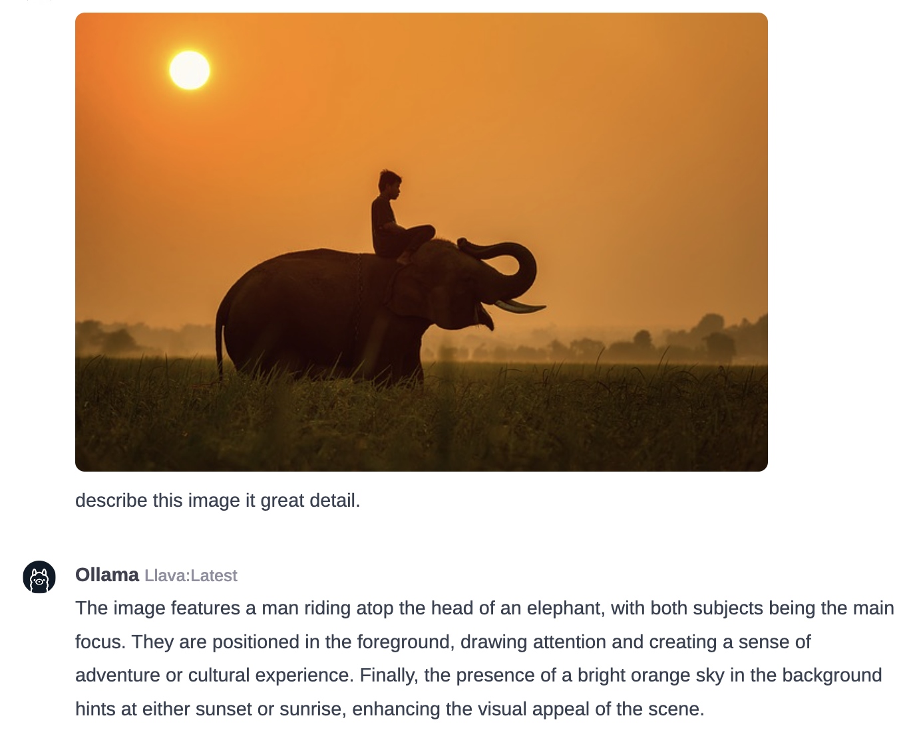
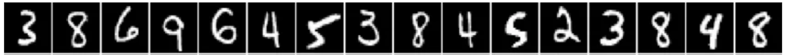
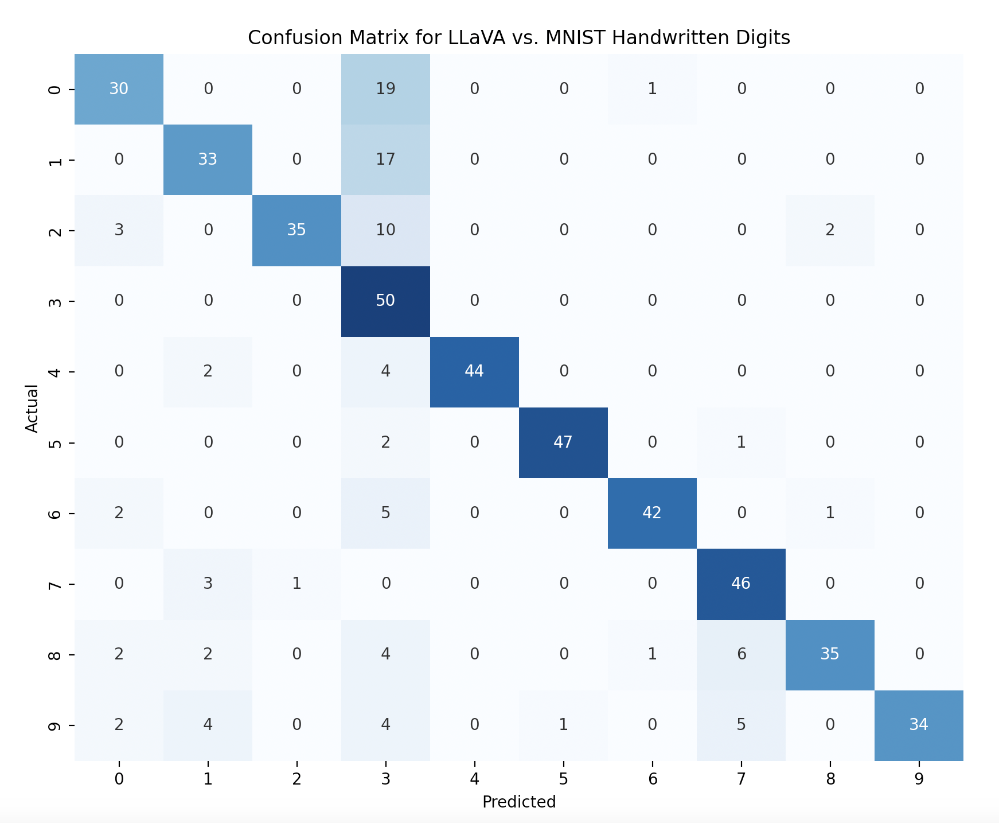
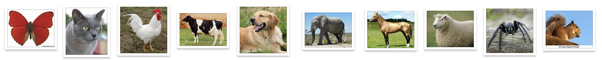
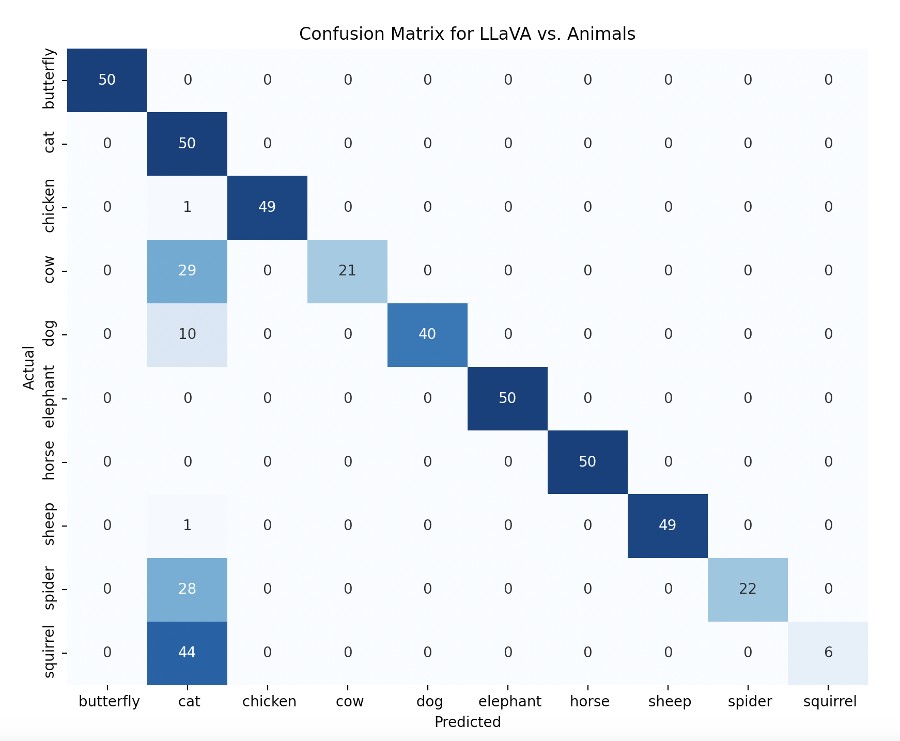
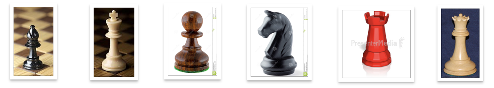
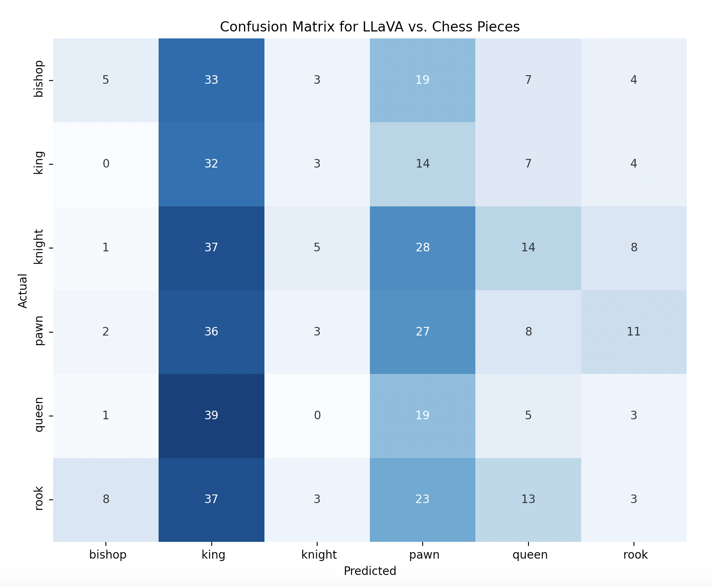

# LLMs for Image Classification

Multimodal models bring computer vision to LLMs so they can both "see" images and have the language to describe the contents of the images. Since LLMs can perform general purpose NLP tasks such as sentiment analysis, named entity recognition, and other text classification tasks, I wondered if vision enabled LLMs could also could replace traditional image classification methods.

Multimodal LLMs can understand the context of an image in relation to natural language descriptions. This is more advanced than traditional methods that classify images based solely on visual features. Combined with their ability to perform zero-shot learning they can potentially classify images into categories they have never seen during training, as long as they understand the category's description. Traditional models require training data for each specific category they need to recognize.

This short weekend project was an attempt explore this possibly, learn something, and of course have some fun. All of the data, code and model definition files used are contained in this repository.

## LLaVA Multimodal Model

OpenAI's Multimodal "GPT-4 Vision" is state of the art and I've been very impressed with it's ability to understand images, and even detect humor and satire (memes, etc.). But lately I've been more interested in the open-source LLMs as I like not having to worry about API keys getting stolen, pathological bugs running up my charges, or worrying about private/sensitive data leaking online.

I'm going to use a 7B parameter quantized version of LLaVA (Large Language and Vision Assistant) for this project. Here are some links to the LLaVA project, papers and model:

LLaVA Project:
- https://llava-vl.github.io/

LLaVA Papers:
- https://arxiv.org/pdf/2304.08485.pdf
- https://arxiv.org/pdf/2310.03744.pdf

LLaVA Quantized Model:
- https://huggingface.co/liuhaotian/llava-v1.5-7b

As an example of what LLaVA is capable of, here is example of asking for a detailed description of an image:

## MNIST Handwritten Digit Classification

The [MNIST database](https://en.wikipedia.org/wiki/MNIST_database) is a large collection of handwritten digits that's commonly used in machine learning image processing tasks. For this test, I used 50 images of each digit (500 total) from the [MNIST as .jpg](https://www.kaggle.com/datasets/scolianni/mnistasjpg) dataset. I created a [mnist-classifer-model](modelfiles/mnist-number-classifier.Modelfile) for this test.

### Results

There results weren't as good as I expected, with only a 79.2% accuracy score. It had trouble with "0", "1", and "2", often confusing them for "3". Strange. A traditional machine learning approach should exceed 98%. 

Confusion Matrix:

Precision and Recall:
| Digit | Precision | Recall | F1-score |
|-------|-----------|--------|----------|
| 0     | 0.769231  | 0.600  | 0.674157 |
| 1     | 0.750000  | 0.660  | 0.702128 |
| 2     | 0.972222  | 0.700  | 0.813953 |
| 3     | 0.434783  | 1.000  | 0.606061 |
| 4     | 1.000000  | 0.880  | 0.936170 |
| 5     | 0.979167  | 0.940  | 0.959184 |
| 6     | 0.954545  | 0.840  | 0.893617 |
| 7     | 0.793103  | 0.920  | 0.851852 |
| 8     | 0.921053  | 0.700  | 0.795455 |
| 9     | 1.000000  | 0.680  | 0.809524 |

Accuracy:
| Metric       | Precision | Recall | F1-score |
|--------------|-----------|--------|----------|
| Accuracy     | 0.792000  | 0.792  | 0.792000 |
| Macro Avg    | 0.857410  | 0.792  | 0.804210 |
| Weighted Avg | 0.857410  | 0.792  | 0.804210 |

## Animal Classification

Next up is animal classification. I used the [Animals-10](https://www.kaggle.com/datasets/alessiocorrado99/animals10) dataset for this and created the [animal-classifier](modelfiles/animal-classifier.Modelfile) model.

### Results
The results for this were also interesting. While it did well for some animal catagories, it clearly had never seen a squirrel before as it classified most squirrels as cats. It also had difficultly distinguishing cows and spiders from cats. It looks like whenever it was unsure about these problem catagories, it just guessed "cat". It had perfect scores on both precision and recall for butterflies, elephants, and horses. It has an average accuracy of 77.4%

Confusion Matrix:

Precision and Recall:
| Animal   | Precision | Recall | F1-score |
|----------|-----------|--------|----------|
| Butterfly| 1.000000  | 1.000  | 1.000000 |
| Cat      | 0.306748  | 1.000  | 0.469484 |
| Chicken  | 1.000000  | 0.980  | 0.989899 |
| Cow      | 1.000000  | 0.420  | 0.591549 |
| Dog      | 1.000000  | 0.800  | 0.888889 |
| Elephant | 1.000000  | 1.000  | 1.000000 |
| Horse    | 1.000000  | 1.000  | 1.000000 |
| Sheep    | 1.000000  | 0.980  | 0.989899 |
| Spider   | 1.000000  | 0.440  | 0.611111 |
| Squirrel | 1.000000  | 0.120  | 0.214286 |

Accuracy:
| Metric       | Precision | Recall | F1-score |
|--------------|-----------|--------|----------|
| Accuracy     | 0.774000  | 0.774  | 0.774000 |
| Macro Avg    | 0.930675  | 0.774  | 0.775512 |
| Weighted Avg | 0.930675  | 0.774  | 0.775512 |

## Chess Piece Classification

The last classification I tried was chess pieces. I used the [chessman-image-dataset](https://www.kaggle.com/datasets/niteshfre/chessman-image-dataset) and created the [chess-classifier](modelfiles/chess-classifier.Modelfile)

### Results

Confusion Matrix:

Precision and Recall:
| Chess Piece | Precision | Recall   | F1-score |
|-------------|-----------|----------|----------|
| Bishop      | 0.294118  | 0.070423 | 0.113636 |
| King        | 0.149533  | 0.533333 | 0.233577 |
| Knight      | 0.294118  | 0.053763 | 0.090909 |
| Pawn        | 0.207692  | 0.310345 | 0.248848 |
| Queen       | 0.092593  | 0.074627 | 0.082645 |
| Rook        | 0.090909  | 0.034483 | 0.050000 |

               
Accuracy:               
| Metric       | Precision | Recall   | F1-score |
|--------------|-----------|----------|----------|
| Accuracy     | 0.165591  | 0.165591 | 0.165591 |
| Macro Avg    | 0.188160  | 0.179496 | 0.136602 |
| Weighted Avg | 0.192235  | 0.165591 | 0.133493 |

## Conclusion  

